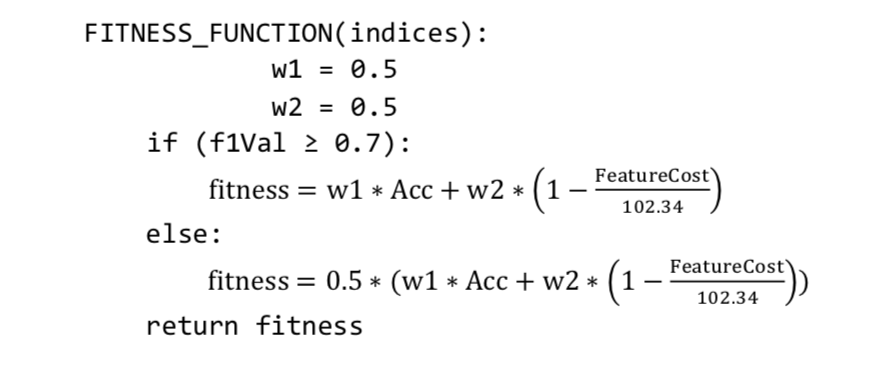
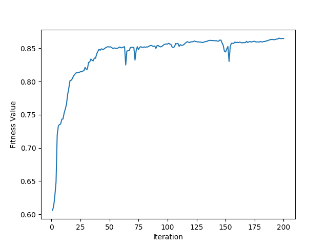

# Genetic-Algorithm-Based-Cost-Sensitive-Learning
A genetic algorithm based approach for cost sensitive learning, in which the misclassification cost is considered together with the cost of feature extraction. 

## Dataset: 
[Thyroid Disease Data Set](http://archive.ics.uci.edu/ml/machine-learning-databases/thyroid-disease/)

When the class label distribution is examined, it is observed that 92% of training set belongs to a single output label. Regardless of the chosen classifier, this distribution tends to learn a bias through the majority label. To deal with this issue, oversampling method is used to create a more balanced dataset. The samples with minority labels are duplicated 20 times in both training and test dataset ending up with a training set with 9452 samples and test set with 8428 samples. 

## Approach: 

When a classifier is applied on a dataset, most of the data attributes are either irrelevant to the evaluation or has a very little impact on it. 
Also, it is known that each attribute has a cost of getting it. The cost list for my dataset is available [here](./data/ann-thyroid.cost.txt).
To be able to find the best attribute set for classification, a genetic algorithm based cost-sensitive learning model is implemented.
For my genetic algorithm, I start my population with 10 hypotheses (each one corresponding to a classifier model with different set of attributes). For each member of population, a fitness value is found with respect to the following fitness function:

After creating the population, I iterated 200 generations with mutation and cross-over operations on the population. Each new created hypothesis is ranked with respect to the fitness values. Best fitness valued offsprings are replaced with the worst fitness valued hypothesis in the population. By so, the number of members in population is kept constant. 

At the end of each generation, the average fitness value of 10 members are stored and shown in the graph below.

***Average Fitness Value of Each Generation***

It is noticeable that after generation 70, the increase in the fitness function slows down and almost saturates.

Emre Doğan

Bilkent University

Department of Computer Engineering

December 18, 2018
